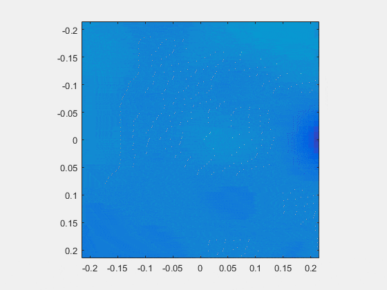
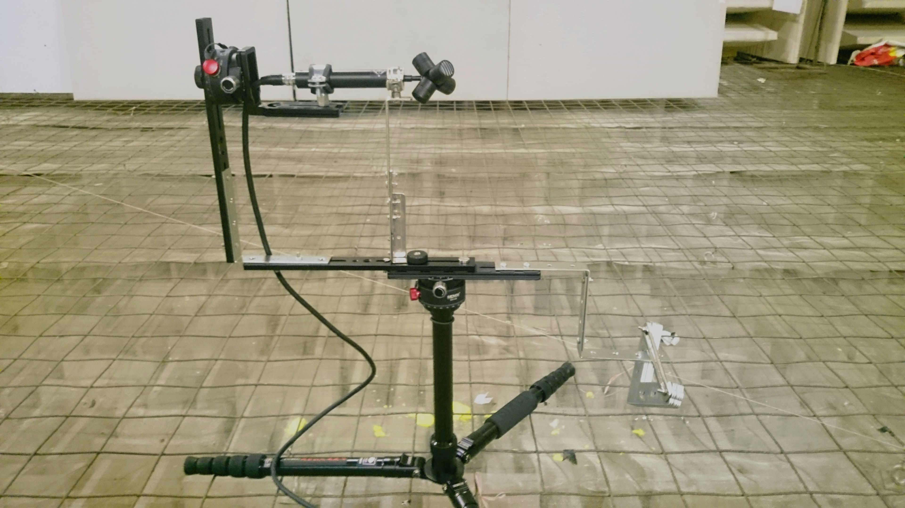

## About Me

Hi! I am a graduate student of Institute of Acoustics of the Chinese Academy of Sciences, majoring in audio signal processing.

Besides the projects concerning on DSP implementation I am doing in work hours, I also has a mania for computer music and creative coding. I'm now scratching up [my Github page](https://github.com/Paranoid2droid){:target="_blank"} to share my ChucK codes, MAX/MSP projects ,and other whatever things I built.

I'm also a bedroom music maker and amateur guitar/bass/drum/synthesizer player! I've released a few EPs and albums with my bandmates or in my own name. Check [my Soundcloud page](https://soundcloud.com/paranoid2droid){:target="_blank"} to hear my works!

One more thing, I am selected as an AMBASSADOR on [Kadenze](https://www.kadenze.com/){:target="_blank"}, which is an amazing place for learn and make all kinds of cool stuff. Meet me [there](https://www.kadenze.com/users/zhe-zhang){:target="_blank"}!

---

## Research Interest

I got a Bachelor Degree in Physics, focusing on Acoustics. I engaged in some projects on room acoustics and concert hall design when I was an undergraduate. I also got a part-time job as an associate audio engineer and stage tech in the most professional livehouse in Shanghai. 

Right now I am doing my Master Degree in Electronic Engineering, with a research subject on DSP implementation of audio processing algorithms. I'm developing real-time system of sound field analysis, including far-field sound source localization and near-field acoustical holography. 

With my experiences of acoustics and audio, I found my passion for research landing on the cross point of computer, music, and acoustics. I finished [more than 10 courses on Kadenze](https://www.kadenze.com/users/zhe-zhang#tab-certificates) related to music technology, computer music and creative coding, including ChucK, MAX/MSP, Physics-DSP, Machine Learning, FAUST, Machine Learning, Web, etc... And I am still working with them to build more interesting and meaningful things. I am looking forward to meet an opportunity to dig into music technology and computer music.

---

## Education

Time      | School                                                    | Degree                         | Major     | GPA
----------|-----------------------------------------------------------|--------------------------------|-----------|------ 
2017 -      | Institute of Acoustics of the Chinese Academy of Sciences | Master of Electric Engineering | Audio Signal Processing | ...
2013 - 2017 | Tongji University                                         | Bachelor of Physics            | Acoustics | 4.6/5 

---

## Experiences

Time      | Location                  | Job Description                  
----------|---------------------------|------------------
2017       | Waves Audio Ltd., Beijing | composing and translating product tech introduction of website of Waves Audio
2016 - 2017 | Institute of Acoustics of Tongji University, Shanghai | research assistance
2016       | Paranoid Android Studio, Shanghai | recording engineer of band The Machinery of Other Skeletons 
2015 - 2017 | MAO Livehouse (Shanghai), Shanghai | associate audio engineer & stage tech
2014 Summer | Environmental Protection Agency of Zhabei District, Shanghai | investigation of roof afforestation plan in Shanghai
2013 Summer | FamilyMart, Shanghai | sales and clerk

---

## Research Projects

* 2019: DSP-based Implementation of Far-field Sound Source Localization Algorithms

Study techniques of sound source localization algorithms such as SRP, develop real-time DSP systems to locate sound sources using microphone array.

* 2018: DSP-based Implementation of Near-field Acoustical Holography Algorithms

Study techniques of near-field acoustical holography algorithms such as SONAH, develop real-time DSP systems to visualize sound field with details of evanescent waves.

* 2017: Measurement of Total Sound Energy Density Based on Sound Field Microphone

Design filter banks converting A-Format audio signal captured by sound field microphones into B-Format and to obtain three-dimensional particle vibration velocity and total sound energy density.

* 2016: Study on the Decay of Sound Energy in Stage-Auditorium Coupled Sound Field of Theaters

Based on a scale model of a theater in sound-proof chamber, modify the acoustical absorption coefficient of stage and auditorium to study the predicting of reverberation in different location inside a theater with acoustical coupling phenomenon between stage and auditorium.

---

## Personal Portfolio

* [Cosmic Echoes: An Interactive Max/MSP Patch Echoes Waves in Sound and Visualization](https://www.kadenze.com/users/zhe-zhang/portfolio_projects/ii-c8d45663-014f-412c-9de1-e0ea8bed9224){:target="_blank"}
* Precode in C: A Piece of Computer Music Work Based on ChucK Programming Inspired by BWV846 of Bach
* shakeFM: A Gravity-controlled FM Synthesizer Based on Wekinator and Chuck Using Machine Learning Algorithms
* Wild Open Space: A Demo Sonic Game with a Remote Control using OSC based on ChucK and OpenGL 
* Grain Step Drum Machine: A Drum Machine with a Digital Clock Modulation Creating Complex but Groovy Rhythm Patterns

---

## Albums & EPs

> *The Artifacts of Ripples*: **A personal music project of mine, exploring the edge of making music in a bedroom. I made the album "Radio Rex" totally by iPad, getting rid of the complexity and expensiveness of traditional music production in studio.**

<iframe width="100%" height="200" scrolling="no" frameborder="no" allow="autoplay" src="https://w.soundcloud.com/player/?url=https%3A//api.soundcloud.com/playlists/703468422&color=%237c766d&auto_play=false&hide_related=false&show_comments=true&show_user=true&show_reposts=false&show_teaser=true&visual=true"></iframe>

<iframe width="100%" height="200" scrolling="no" frameborder="no" allow="autoplay" src="https://w.soundcloud.com/player/?url=https%3A//api.soundcloud.com/playlists/703446387&color=%236c8b5c&auto_play=false&hide_related=false&show_comments=true&show_user=true&show_reposts=false&show_teaser=true&visual=true"></iframe>

<iframe width="100%" height="200" scrolling="no" frameborder="no" allow="autoplay" src="https://w.soundcloud.com/player/?url=https%3A//api.soundcloud.com/tracks/571439184&color=%235c6c44&auto_play=false&hide_related=false&show_comments=true&show_user=true&show_reposts=false&show_teaser=true&visual=true"></iframe>

> *Subaqua Roaming Guide*: **A band with my friends Shenyang Xu and Yonglin Zhang. I did some parts of the composing, recording, sampling, mixing, vocal, electric guitar, synthesizer, and sound effects in the works.**

<iframe width="100%" height="200" scrolling="no" frameborder="no" allow="autoplay" src="https://w.soundcloud.com/player/?url=https%3A//api.soundcloud.com/playlists/703417029&color=%230a3665&auto_play=false&hide_related=false&show_comments=true&show_user=true&show_reposts=false&show_teaser=true&visual=true"></iframe>

<iframe width="100%" height="200" scrolling="no" frameborder="no" allow="autoplay" src="https://w.soundcloud.com/player/?url=https%3A//api.soundcloud.com/playlists/702584835&color=%235b759c&auto_play=false&hide_related=false&show_comments=true&show_user=true&show_reposts=false&show_teaser=true&visual=true"></iframe>

---

## Publications

On the fuck going...!!!

---

## Skills

* **Programming**: *C/C++, Matlab, DSP Developing, Python, Javascript*
* **Audio Processing**: *ChucK, MAX/MSP, Wekinator, FAUST, Reaktor*
* **Music Production**: *Recording & PA, Audio Mixing, Sound Design*
* **Acoustic Design**: *COMSOL*

## Others

I am a soundscape recorder, nature conversation volunteer, and a marathon runner.