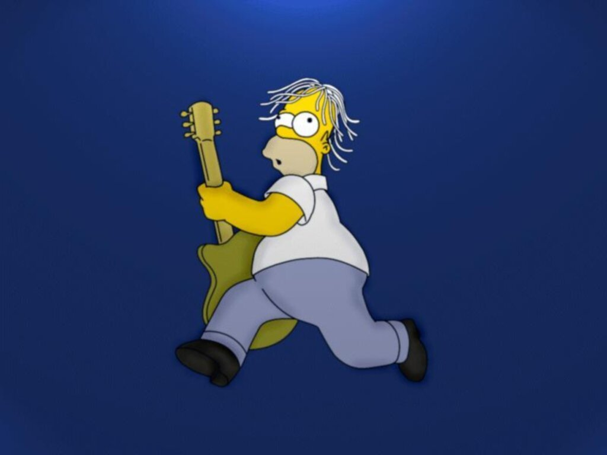

## About Me

Hi! I am a graduate student of Institute of Acoustics of the Chinese Academy of Sciences, majoring in audio signal processing.

Besides the projects concerning on DSP implementation I am doing in work hours, I also has a mania for computer music and creative coding. I'm now scratching up [my Github page](https://github.com/Paranoid2droid) to share my ChucK codes, MAX/MSP projects ,and other whatever things I built.

I'm also a bedroom music maker! I've released a few EPs and albums with my bandmates or in my own name. Check [my Soundcloud page](https://soundcloud.com/paranoid2droid) to see my works!

One more thing, I am selected as an AMBASSADOR on [Kadenze](https://www.kadenze.com/), which is an amazing place for learn and make all kinds of cool stuff. Meet me [there](https://www.kadenze.com/users/zhe-zhang)!

---

## Research Interest

I got a Bachelor Degree in Physics, focusing on Acoustics. I engaged in some projects on room acoustics and concert design when I was undergraduate. I also got a part-time job as an associate audio engineer and stage tech in the most professional livehouse in Shanghai. 

Right now I am doing my Master Degree in Electronic Engineering, with a research subject on DSP implementation of audio processing algorithms. I'm developing real-time system of soundfield analysis, including far-field sound source localization and near-field acoustic holography. 

With my experiences of acoustics and audio, I found myself get a mania for the cross point of computer, music, and acoustics. I finished more than 10 courses on Kadenze about music technology and computer music, including ChucK, MAX/MSP, Physics-DSP, Machine Learning, FAUST, Machine Learning, Web, etc... I'm looking forward to meet an opportunity to dig into music technology and computer music.

---

## Education

Time      | School                                                    | Degree                         | Major     | GPA
----------|-----------------------------------------------------------|--------------------------------|-----------|------ 
2013-2017 | Tongji University                                         | Bachelor in Physics            | Acoustics | 4.6/5 
2017-     | Institute of Acoustics of the Chinese Academy of Sciences | Master of Electric Engineering | Audio Signal Processing | ...

---

## Publications

1. F.Bar, J.Doe: Effects of having a placeholder of a name
2. S.Holmes, J.Watson: Consequences of living with a sociopath in London

## Typography

This is a [link](http://google.com). Something *italics* and something **bold**.

Here is a table

Year | Award | Category
-----|-------|--------
2014 | Emmy  | Won Outstanding Lead Actor in a miniseries or a movie
2015 | BAFTA | Nominated for Best Leading Actor for Sherlock
2014 | Satellite | Won Best Actor miniseries or television film

Here is a horizontal rule

---

Here is a blockquote

> To a great mind, nothing is little

## References

* Foo Bar: Head of Department, Placeholder Names, Lorem
* John Doe: Associate Professor, Department of Computer Science, Ipsum
