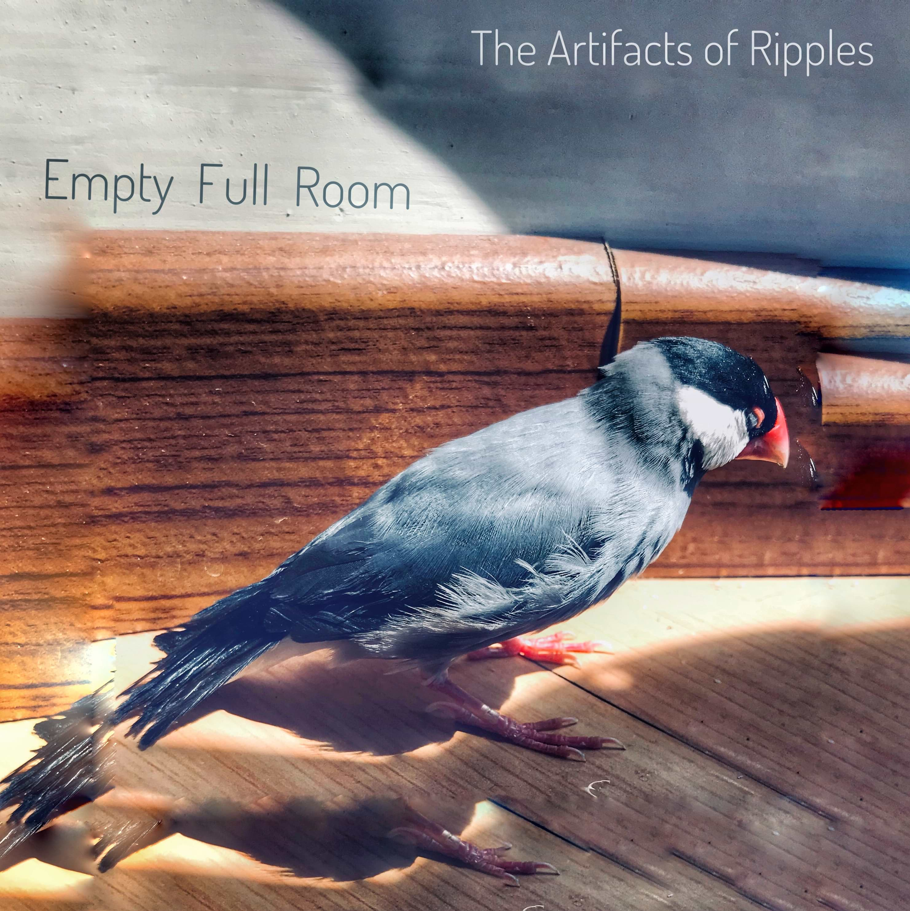

## About Me

Hi! I'm an audio algorithm engineer and researcher in a music technology start-up now. I got a Master's degree in electronic engineering, focusing on audio signal processing and a Bachelor's degree in applied physics, focusing on acoustics. 

On top of my research experience in audio and DSP, I also have a mania for computer music and music tech. All the source codes of my synthesizers, plug-ins, audiovisual, computer music and other stuff are on [my Github page](https://github.com/Paranoid2droid){:target="_blank"}.

I'm also a music maker and multi-instrument player. Check out my released albums and EPs on [my SoundCloud page](https://soundcloud.com/paranoid2droid){:target="_blank"}.

One more thing, I am selected as an AMBASSADOR on [Kadenze](https://www.kadenze.com/){:target="_blank"}, which is an amazing place for learn and make all kinds of cool stuff. Meet me [there](https://www.kadenze.com/users/zhe-zhang){:target="_blank"}!

---

## Research Interest

During undergraduate period, I engaged in a research on room acoustics and concert hall design. I also worked as an associate sound engineer and stage tech in [MAO Livehouse](http://mao-music.com){:target="_blank"} during undergraduate years.

In graduate institute, my research subject was DSP implementation of audio processing algorithms. I researched on front-end audio algorithms and developed real-time sound field analysis systems, including far-field sound source localization and near-field acoustical holography. 

With my experiences of acoustics and audio, I found my passion for research land on the cross point of computer, music, and acoustics. I finished [more than 10 courses on Kadenze](https://www.kadenze.com/users/zhe-zhang#tab-certificates){:target="_blank"} related to music technology, computer music and creative coding, including ChucK, MAX/MSP, Physics-DSP, JUCE, FAUST, Machine Learning, Web, etc., and built several personal projects including synthesizers, audio plug-ins, and interactive computer music.

After graduation, I joined a music technology start-up as an audio algorithm engineer. I develop audio algorithms in our AI-driven virtual singer app, including DL-based singing voice synthesizing and traditional music signal processing like time stretching and pitch shifting. I am looking forward to digging into music technology and computer music.

---

## Education

Time      | School                                                    | Degree                         | Major     
----------|-----------------------------------------------------------|--------------------------------|----------- 
2017 - 2020 | Institute of Acoustics, Chinese Academy of Sciences | Master of Electric Engineering | Audio Signal Processing 
2013 - 2017 | Tongji University                                         | Bachelor of Applied Physics        | Acoustics 

---

## Experiences

Time      | Location                  | Job Description                  
----------|---------------------------|------------------
2020 - present | Beijing Timedomain Technology Co., Ltd. | Audio Algorithm Engineer & Music Technology Researcher
2019 - 2020 | E-Business(band), Beijing | Recording & Mixing Engineer
2018 - 2019 | Chinese Folk Orchestra of University of Chinese Academy of Sciences, Beijing | Audio Engineer & PA Engineer
2017        | Waves Audio Ltd., Beijing | Tech Documents Composing and Translating
2016 - 2017 | Institute of Acoustics of Tongji University, Shanghai | Research Assistant
2016 - 2017 | The Machinery of Other Skeletons(band), Shanghai | Recording Engineer 
2015 - 2017 | MAO Livehouse, Shanghai | Associate Sound Engineer & Stage Tech
2014 Summer | Environmental Protection Agency of Zhabei District, Shanghai | Investigator of Roof Afforestation Plan in Shanghai

---

## Research Projects

* 2020(on going): Research on Various Approaches of Singing Voice Synthesizing for an AI Virtual Singer App

Demonstrated and evaluated various singing voice synthesizing algorithms, including traditional algorithms like the WORLD vocoder, deep networks based approaches like Seq2Seq, WaveRNN, WaveGrad, etc., and the combination of the methods.

 

* 2020(on going): Note2F0: A Deep Learning Model Generating F0 from MIDI Notes based on Transformer

Extracted midi and f0 data from recorded singing audio files and designed a deep learning network based on Transformer to generate natural f0 trajectories from midi notes for singing voice synthesizing.

 

* 2019: Real-time DSP Sound Source Localization System Based on Circular Microphone Array Using SRP Method in Harmonic Domain

Optimized SRP algorithm in circular harmonic domain for DSP and developed a real-time sound source localization system which can estimate the azimuth of sound source with one-frame latency.  

 

* 2019: Sound Localization and Separation in Three-dimensional Space Using a Single Microphone with a Metamaterial Enclosure

Used a 3D-printed enclosure to modify the frequency response of an omni-directional microphone in a direction-independent way, utilized compress sensing techniques and other processing to reconstruct the information about location and audio content of sound sources.

 

* 2018: DSP-Based Implementation of a Real-time Sound Field Visualization System Using SONAH Algorithm

Studied techniques of near-field acoustical holography algorithms such as SONAH, develop real-time DSP systems to visualize sound field with details of evanescent waves.

 

* 2018: Improved MUSIC Algorithm with Enhanced Matrix for Estimating Harmonic Components

Estimated the number of harmonic components by observing the trend of eigenvalue of self-correlation matrix of the signal's enhanced matrix to determine the sub-space of MUSIC algorithm, providing a better performance in low SNR situations.

 

* 2017: Measurement of Total Sound Energy Density Based on Sound Field Microphone

Designed filter banks converting A-Format audio signal captured by sound field microphones into B-Format and to obtain three-dimensional particle vibration velocity and total sound energy density.

 

* 2016: Study on the Decay of Sound Energy in Stage-Auditorium Coupled Sound Field of Theaters

Built a scale model of a theater in sound-proof chamber, modified the acoustic absorption coefficient of stage and auditorium to predict the reverberation in different location inside a theater with acoustical coupling phenomenon between stage and auditorium.

---

## Personal Portfolio

* [ParanoidChorus](https://github.com/paranoid2droid/ParanoidChorus){:target="_blank"}: A Chorus-like Effect Plug-in/Standalone Application based on JUCE

* [Cosmic-Echoes](https://github.com/paranoid2droid/Cosmic-Echoes){:target="_blank"}: An Interactive MAX/MSP Patch with Audiovisual

* [Wild Open Space](https://github.com/paranoid2droid/WildOpenSpace){:target="_blank"}: A Demo Sonic Game with a Remote Control using OSC based on ChucK and OpenGL

* [shakeFM](https://github.com/paranoid2droid/shakeFM){:target="_blank"}: A Gravity-controlled FM Synthesizer Based on Wekinator and Chuck Using Machine Learning Algorithms

* [GrainBeats](https://github.com/paranoid2droid/GrainBeats){:target="_blank"}: A Drum Machine with a Digital Clock Modulation Creating Complex but Groovy Rhythm Patterns

* [PressAnyKey](https://github.com/paranoid2droid/PressAnyKey){:target="_blank"}: A Keyboard-controlled Step Audio/Video Sequencer Based on MAX/MSP

* [whenIAmKingYouWillBeFirstAgainstWall](https://github.com/paranoid2droid/whenIAmKingYouWillBeFirstAgainstWall){:target="_blank"}: An Open-source Computer Music Album Based on ChucK (I call it a "Chulbum")

*(I have a specialized page for project showcase: [**Zhe's Portfolio**](https://zhezhang.me/portfolio/){:target="_blank"})*

---

## Albums & EPs

> *The Artifacts of Ripples*: **A personal music project of mine, exploring the edge of making music in a bedroom. I made the album *Radio Rex* totally by iPad, getting rid of the complexity and expensiveness of traditional music production in studio.**

> *Subaqua Roaming Guide*: **A band with my friends *Shenyang Xu* and *Yonglin Zhang*. I did some parts of the composing, recording, sampling, mixing, vocal, electric guitar, synthesizer, and sound effects in the works.**

---

## Publications

1. **Z. Zhang**, M. Wu, and J. Yang, “*DSP-Based Implementation of a Real-Time Sound Field Visualization System Using SONAH Algorithm*,” in Advances in Harmony Search, Soft Computing and Applications, Cham, 2020, pp. 99–110.
2. X.Y. Han, M. Wu, J. Yang, **Z. Zhang**, “*Sound Source Localization Using Distributed Microphone in Spherical Harmonics Domain*,” Journal of Signal Processing, vol. 35, no. 9, pp. 1564-1571, Sep. 2019.
3. X.C. Sun, H. Jia, **Z. Zhang**, Y.Z. Yang, Z.Y. Sun, and J. Yang, “*Sound Localization and Separation in Three-dimensional Space Using a Single Microphone with a Metamaterial Enclosure*,” Advanced Science, DOI: 10.1002/advs.201902271, 2019.
4. **Z. Zhang**, M. Wu, X.Y. Han, and J. Yang, “*Performance Comparison of UCA and UCCA based Real-time Sound Source Localization Systems using Circular Harmonics SRP Method*,” Applied Acoustics, DOI:10.1016/j.apacoust.2020.107241, 2019.

---

## Skills

* **Programming**: *Python/PyTorch, C/C++, Matlab, DSP Software Developing*
* **Audio Processing**: *ChucK, MAX/MSP, JUCE, Wekinator, FAUST, Reaktor*
* **Music Production**: *Recording & PA, Audio Mixing, Sound Design*
* **Acoustic Design**: *COMSOL, SMAART*

## Others

I am a soundscape recorder, a nature conservation volunteer, and a marathon runner.