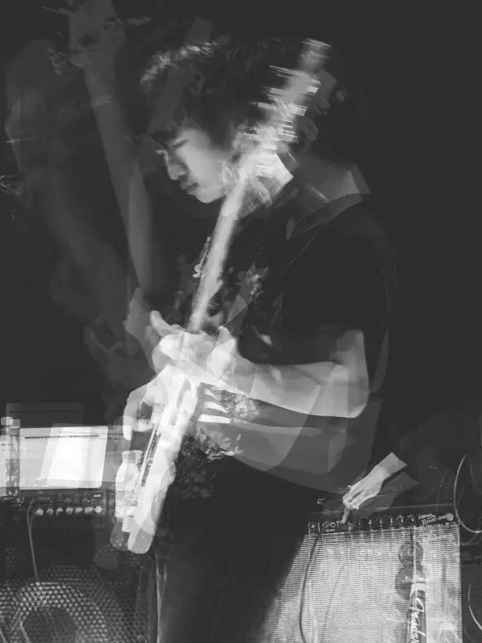
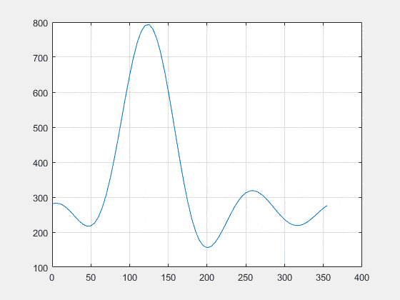
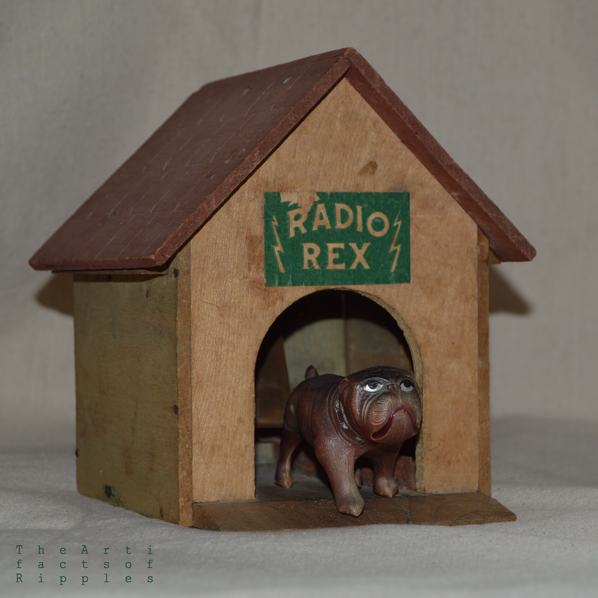

## About Me

Hi! I am a graduate student from [Institute of Acoustics, Chinese Academy of Sciences](http://english.ioa.cas.cn/){:target="_blank"}, majoring in audio signal processing.

On top of the research projects about DSP algorithms in work hours, I also have a mania for computer music and music tech. I'm now starting [my Github page](https://github.com/Paranoid2droid){:target="_blank"} from scratch to share my ChucK codes, MAX/MSP projects, plug-ins and other things I built.

I'm also a music maker and multi-instrument player. I've released a few EPs and albums. You may check them out on [my SoundCloud page](https://soundcloud.com/paranoid2droid){:target="_blank"}.

One more thing, I am selected as an AMBASSADOR on [Kadenze](https://www.kadenze.com/){:target="_blank"}, which is an amazing place for learn and make all kinds of cool stuff. Meet me [there](https://www.kadenze.com/users/zhe-zhang){:target="_blank"}!

---

## Research Interest

I earned a B.S. Degree in Applied Physics, focusing on Acoustics. I engaged in a research on room acoustics and concert hall design during undergraduate years. I also worked as an associate audio engineer and stage tech in [MAO Livehouse](http://mao-music.com){:target="_blank"}.

Right now I am doing my M.E. Degree in Electronic Engineering, with a research subject on DSP implementation of audio processing algorithms. I'm developing real-time systems of sound field analysis, including far-field sound source localization and near-field acoustical holography. 

With my experiences of acoustics and audio, I found my passion for research land on the cross point of computer, music, and acoustics. Lately I've finished [more than 10 courses on Kadenze](https://www.kadenze.com/users/zhe-zhang#tab-certificates){:target="_blank"} related to music technology, computer music and creative coding, including ChucK, MAX/MSP, Physics-DSP, JUCE, FAUST, Machine Learning, Web, etc. And I am still working with them to build more interesting and meaningful works. I am looking forward to finding an opportunity to dig into music technology and computer music.

---

## Education

Time      | School                                                    | Degree                         | Major     
----------|-----------------------------------------------------------|--------------------------------|----------- 
2017 -      | Institute of Acoustics, Chinese Academy of Sciences | Master of Electric Engineering | Audio Signal Processing 
2013 - 2017 | Tongji University                                         | Bachelor of Applied Physics        | Acoustics 

---

## Experiences

Time      | Location                  | Job Description                  
----------|---------------------------|------------------
2018 - 2019 | Chinese Folk Orchestra of University of Chinese Academy of Sciences, Beijing | Audio Engineer & PA Engineer
2017        | Waves Audio Ltd., Beijing | Tech Documents Composing and Translating
2016 - 2017 | Institute of Acoustics of Tongji University, Shanghai | Research Assistant
2016 - 2017 | Paranoid Android Music Studio, Shanghai | Recording & Mixing Engineer 
2015 - 2017 | MAO Livehouse, Shanghai | Associate Audio Engineer & Stage Tech
2014 Summer | Environmental Protection Agency of Zhabei District, Shanghai | Investigator of Roof Afforestation Plan in Shanghai

---

## Research Projects

* 2019: Real-time DSP Sound Source Localization System Based on Circular Microphone Array Using SRP Method in Harmonic Domain

Optimized SRP algorithm in circular harmonic domain for DSP and developed a real-time sound source localization system which can estimate the azimuth of sound source with one-frame latency.  

* 2019: Sound Localization and Separation in Three-dimensional Space Using a Single Microphone with a Metamaterial Enclosure

Used a 3D-printed enclosure to modify the frequency response of an omnidirectional microphone in a direction-independent way, utilized compress sensing techniques and other processing to reconstruct the information about location and audio content of sound sources.

* 2018: DSP-Based Implementation of a Real-time Sound Field Visualization System Using SONAH Algorithm

Studied techniques of near-field acoustical holography algorithms such as SONAH, develop real-time DSP systems to visualize sound field with details of evanescent waves.

* 2018: Improved MUSIC Algorithm with Enhanced Matrix for Estimating Harmonic Components

Estimated the number of harmonic components by observing the trend of eigenvalue of self-correlation matrix of the signal's enhanced matrix to determine the sub-space of MUSIC algorithm, providing a better performance in low SNR situations.

* 2017: Measurement of Total Sound Energy Density Based on Sound Field Microphone

Designed filter banks converting A-Format audio signal captured by sound field microphones into B-Format and to obtain three-dimensional particle vibration velocity and total sound energy density.

* 2016: Study on the Decay of Sound Energy in Stage-Auditorium Coupled Sound Field of Theaters

Based on a scale model of a theater in sound-proof chamber, modified the acoustic absorption coefficient of stage and auditorium to predict the reverberation in different location inside a theater with acoustical coupling phenomenon between stage and auditorium.

---

## Personal Portfolio

* [Cosmic Echoes](https://www.kadenze.com/users/zhe-zhang/portfolio_projects/ii-c8d45663-014f-412c-9de1-e0ea8bed9224){:target="_blank"}: An Interactive Max/MSP Patch Echoes Waves in Sound and Visualization
* [Wild Open Space](https://www.kadenze.com/users/zhe-zhang/portfolio_projects/ii-049c2bd7-8041-4516-af5f-20e5a5000bfe){:target="_blank"}: A Demo Sonic Game with a Remote Control using OSC based on ChucK and OpenGL
* [shakeFM](https://www.kadenze.com/users/zhe-zhang/portfolio_projects/ii-fce6beee-9e64-4267-90d5-47787cc00a81){:target="_blank"}: A Gravity-controlled FM Synthesizer Based on Wekinator and Chuck Using Machine Learning Algorithms
* [Grain Step Drum Machine](https://www.kadenze.com/users/zhe-zhang/portfolio_projects/ii-84b86424-faa1-47b1-9830-6a3c3ce94fe5){:target="_blank"}: A Drum Machine with a Digital Clock Modulation Creating Complex but Groovy Rhythm Patterns
* Precode in C: A Piece of Computer Music Work Based on ChucK Programming Inspired by BWV846 of Bach

*(more linking contents under construction on [my kadenze portfolio page](https://www.kadenze.com/users/zhe-zhang#tab-portfolio)...)*

---

## Albums & EPs

> *The Artifacts of Ripples*: **A personal music project of mine, exploring the edge of making music in a bedroom. I made the album *Radio Rex* totally by iPad, getting rid of the complexity and expensiveness of traditional music production in studio.**

<!---
[{:height="100px" width="100px" style="float:left"}](https://theartifactsofripples.bandcamp.com/album/radio-rex)
-->

<!--
<iframe width="100%" height="200" scrolling="no" frameborder="no" allow="autoplay" src="https://w.soundcloud.com/player/?url=https%3A//api.soundcloud.com/playlists/703468422&color=%237c766d&auto_play=false&hide_related=false&show_comments=true&show_user=true&show_reposts=false&show_teaser=true&visual=true"></iframe>

<iframe width="100%" height="200" scrolling="no" frameborder="no" allow="autoplay" src="https://w.soundcloud.com/player/?url=https%3A//api.soundcloud.com/playlists/703446387&color=%236c8b5c&auto_play=false&hide_related=false&show_comments=true&show_user=true&show_reposts=false&show_teaser=true&visual=true"></iframe>

<iframe width="100%" height="200" scrolling="no" frameborder="no" allow="autoplay" src="https://w.soundcloud.com/player/?url=https%3A//api.soundcloud.com/tracks/571439184&color=%235c6c44&auto_play=false&hide_related=false&show_comments=true&show_user=true&show_reposts=false&show_teaser=true&visual=true"></iframe>
-->

> *Subaqua Roaming Guide*: **A band with my friends *Shenyang Xu* and *Yonglin Zhang*. I did some parts of the composing, recording, sampling, mixing, vocal, electric guitar, synthesizer, and sound effects in the works.**

<!---
<iframe width="100%" height="200" scrolling="no" frameborder="no" allow="autoplay" src="https://w.soundcloud.com/player/?url=https%3A//api.soundcloud.com/playlists/703417029&color=%230a3665&auto_play=false&hide_related=false&show_comments=true&show_user=true&show_reposts=false&show_teaser=true&visual=true"></iframe>

<iframe width="100%" height="200" scrolling="no" frameborder="no" allow="autoplay" src="https://w.soundcloud.com/player/?url=https%3A//api.soundcloud.com/playlists/702584835&color=%235b759c&auto_play=false&hide_related=false&show_comments=true&show_user=true&show_reposts=false&show_teaser=true&visual=true"></iframe>
-->

---

## Publications

1. Zhe Zhang, Ming Wu, Jun Yang. DSP-Based Implementation of a Real-Time Sound Field Visualization System Using SONAH Algorithm[C]. Advances in Harmony Search, Soft Computing and Applications. ICHSA 2019. Advances in Intelligent Systems and Computing, vol 1063, 2019.
2. Xuecong Sun, Han Jia, Zhe Zhang, et al. Sound Localization and Separation in Three-dimensional Space Using a Single Microphone with a Metamaterial Enclosure[J]. arXiv:1908.08160, 2019. (Submitted)
3. Xinyu Han, Ming Wu, Jun Yang, Zhe Zhang. Sound Source Localization Using Distributed Microphone in Spherical Harmonics Domain[J]. Journal of Signal Processing, 2019. (Accepted)

---

## Skills

* **Programming**: *C/C++, Matlab, DSP Software Developing, Python, Javascript*
* **Audio Processing**: *ChucK, MAX/MSP, JUCE, Wekinator, FAUST, Reaktor*
* **Music Production**: *Recording & PA, Audio Mixing, Sound Design*
* **Acoustic Design**: *COMSOL*

## Others

I am a soundscape recorder, a nature conservation volunteer, and a marathon runner.